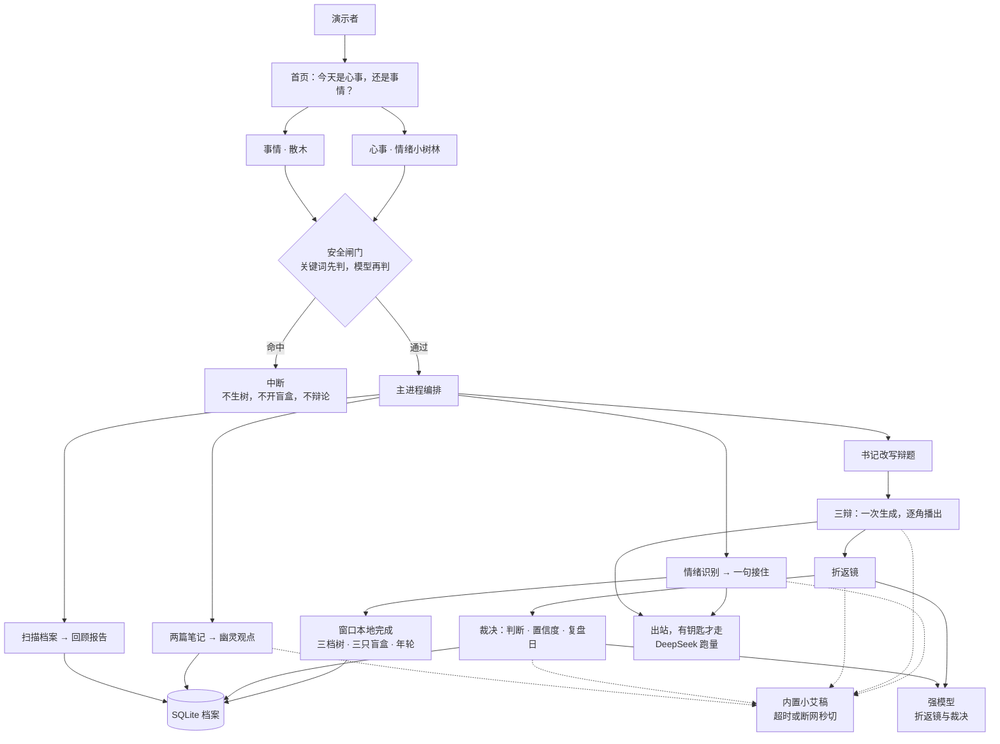
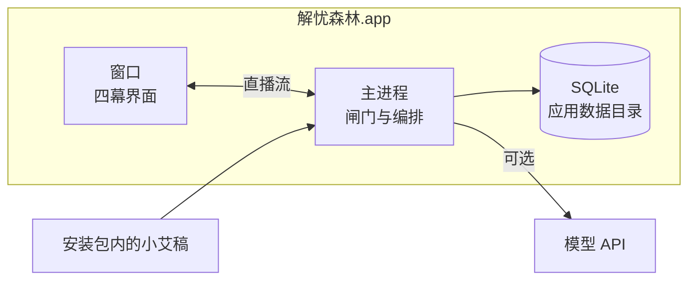
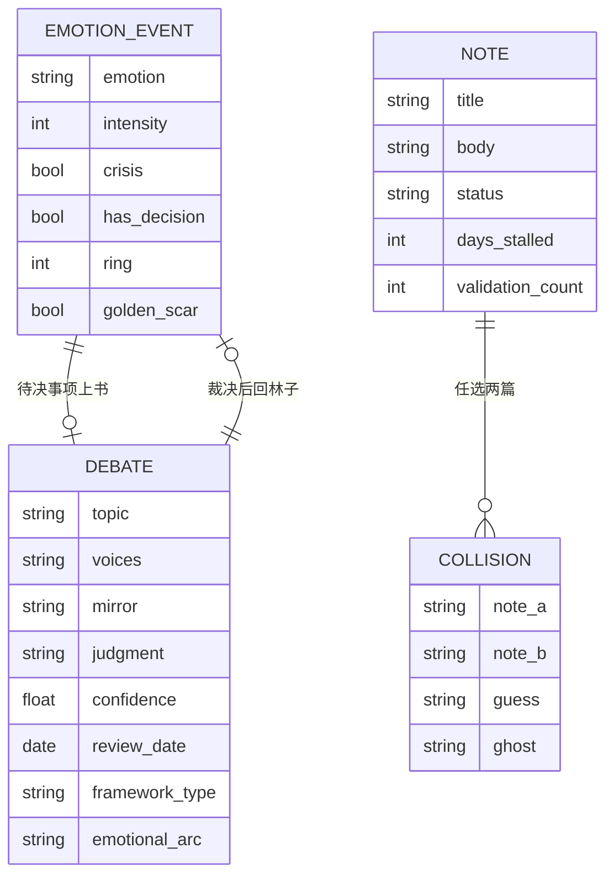

# 解忧森林 · 48 小时封包架构

双击打开的 Mac 应用：窗口跑四幕，主进程做闸门、编排和档案。模型只是可选出站，演示不依赖它。

## 运行时

双线在闸门之后才分叉。心事走完若藏着待决事项，可以上书；裁决页可以回到林子。碰撞和报告只读同一份档案。

## 进程

窗口断了不影响兜底稿。预录视频在安装包外，由演示的人切，不进这条链路。

## 档案

## 封包边界

封包内：安全闸门、吐槽到年轮、上书到裁决、幽灵碰撞、回顾报告基础版、小艾合成档案。

封包外：登录、移动端、服务器、真实笔记库、情绪森林、五级成长。
