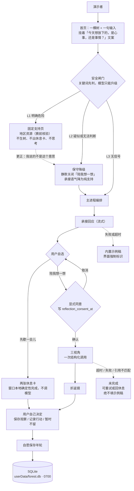
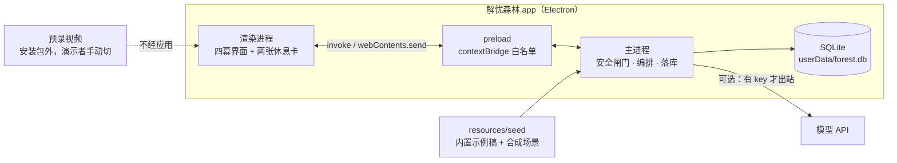

# 解忧森林 · 48 小时封包架构（Mac .app）

> 版本：v2 · 依据 2026-10-02 共识重写 · 取代 v1
> 本文件是 48 小时施工的**唯一技术事实源**。产品语义以《散木小树林 PRD v2.0 融合版》为准（该文件在仓库外），术语以 [CONTEXT.md](../CONTEXT.md) 为准，逐条决策理由见 [docs/adr](./adr/)。

## 0. 本版作废了什么

v1 把三件与 PRD 冲突的事写进了架构。它们现在正式作废，任何人不得再按 v1 施工：

| v1 的写法 | 现状 | 理由 |
| :--- | :--- | :--- |
| 手机浏览器 Web、Next.js、浏览器存储、390px 验收 | **作废**。交付形态是 Mac .app | ADR-0001 |
| 首页「今天是心事，还是事情？」作为强制分叉 | **作废**。那句话降级为首页文案，机制上无分叉 | 分流必须发生在承接之后，否则"知情同意"退化为"进门前分类" |
| EMOTION_EVENT 每次表达写一行（含 golden_scar） | **作废**。未保存的表达不落任何表 | ADR-0002、ADR-0005 |
| 书记 / 三辩 / 裁决 / 三只盲盒 / 吐槽 / 上书 / 小艾 | **作废**。全部对齐 PRD 术语 | 见 CONTEXT.md 的 _Avoid_ 名单 |

同时出封包（第 20 小时闸门之前不做）：幽灵种子、手动棱镜、示例森林、回顾报告。"回顾报告基础版"在 v1 里从未被定义过，若赛后恢复此功能，需先给出三句话定义。

## 1. 运行时



两条不变量，任何实现都必须成立：

1. **没有 reflection_consent_at，就没有认知挑战。** 思考路径的唯一门禁是这条时间戳，不是 UI 上的按钮状态。状态机不能绕过它。
2. **思考层的失败永远呈现为"未完成"。** 承接层可以兜底（内置示例稿 + 强制标识），思考层不可以。见 ADR-0004。

## 2. 进程与 IPC 契约



主进程独占三件事：安全判定、模型调用、SQLite 写入。渲染进程不发网络请求、不碰数据库、不做安全判断。v1 说的"直播流"就是下面的分块推送，不需要另立协议。

**渲染进程 → 主进程（invoke）**

| 通道 | 入参 | 出参 | 说明 |
| :--- | :--- | :--- | :--- |
| session:submit | input, emotion?, intensity? | sessionId, status | 空白输入在此拒绝 |
| session:retryReceive | sessionId | status | 承接层重试 |
| safety:correct | sessionId | status | 用户更正误判；只恢复休息路径 |
| path:choose | sessionId, path | status | path 只能是 rest 或 reflect |
| reflect:consent | sessionId | status | 写 reflection_consent_at；调用三视角的唯一合法入口 |
| reflect:cancel | sessionId | status | 保留已输入内容，不产生失败反馈 |
| reflect:retry | sessionId | status | 超时后重试 |
| ring:save | sessionId, payload, idempotencyKey | ringId | 幂等；见 §3 |
| ring:list / ring:get / ring:delete | — | — | 删除后列表与详情均不可再读 |
| review:save | ringId, payload | reviewId | 不覆盖原决定 |
| data:clearAll | — | ok | 清空全部本地数据，随后校验 |
| demo:reset | — | ok | 清空本场合成数据 |

**主进程 → 渲染进程（webContents.send）**

| 通道 | 载荷 | 说明 |
| :--- | :--- | :--- |
| stream:receive | sessionId, delta, done | 承接回应分块 |
| stream:reflection | sessionId, card, delta, done | card ∈ guardian / explorer / outsider / mirror |
| safety:verdict | sessionId, level | level ∈ L1 / L2，L3 不下发 |
| state:changed | sessionId, status | 驱动界面状态机 |
| stage:error | sessionId, stage, code | 只报阶段与错误类别，不带用户原文 |

状态机：draft → receiving → choosing → resting | reflecting → optional_save → ended。进入 reflecting 必须另带 consented 标记，由主进程校验，不能由状态跳转绕过。

## 3. 数据模型

PRD §9.3 的五张表是唯一事实源。v1 的 ER 图整张作废。

**最重要的一条规则：未保存的表达不落任何表。** Session 行只在用户按下保存之后才写入；在此之前，会话状态只存在于主进程内存里，退出即消失。这直接来自 PRD §9.2 与 F04 验收。

```sql
PRAGMA journal_mode = WAL;
PRAGMA foreign_keys = ON;

-- 仅在用户按下「保存」后才出现这一行
CREATE TABLE session (
  id                    TEXT PRIMARY KEY,
  input                 TEXT NOT NULL,
  selected_emotion      TEXT,
  selected_intensity    TEXT,
  mode                  TEXT NOT NULL CHECK (mode IN ('rest','reflect')),
  reflection_consent_at TEXT,          -- NULL = 从未同意；思考路径的唯一门禁
  status                TEXT NOT NULL,
  is_demo               INTEGER NOT NULL DEFAULT 0
);

CREATE TABLE reflection (
  session_id        TEXT PRIMARY KEY REFERENCES session(id) ON DELETE CASCADE,
  views             TEXT NOT NULL,     -- JSON：三视角，AI 建议原文
  quoted_input      TEXT NOT NULL,     -- JSON：引用片段，必须能在 input 中逐字命中
  assumptions       TEXT,              -- JSON：折返镜提出的前提
  reframed_question TEXT,
  prompt_version    TEXT NOT NULL
);

CREATE TABLE ring (
  id               TEXT PRIMARY KEY,
  session_id       TEXT NOT NULL REFERENCES session(id) ON DELETE CASCADE,
  type             TEXT NOT NULL CHECK (type IN ('support','action')),
  user_note        TEXT NOT NULL,      -- 用户最终文字，与 AI 建议分列
  save_original    INTEGER NOT NULL DEFAULT 0,
  original_text    TEXT,               -- 仅 save_original = 1 时非空
  user_decision    TEXT,
  action           TEXT,
  criterion        TEXT,
  review_due       TEXT,
  created_at       TEXT NOT NULL,
  is_demo          INTEGER NOT NULL DEFAULT 0,
  idempotency_key  TEXT NOT NULL UNIQUE
);
CREATE INDEX ring_created_idx ON ring(created_at DESC);

CREATE TABLE review (
  id              TEXT PRIMARY KEY,
  ring_id         TEXT NOT NULL REFERENCES ring(id) ON DELETE CASCADE,
  executed        INTEGER,
  observed_result TEXT,
  premise_update  TEXT,
  next_step       TEXT,
  created_at      TEXT NOT NULL
);
CREATE INDEX review_ring_idx ON review(ring_id);

-- 只记类别，永不记正文
CREATE TABLE interaction_event (
  anonymous_session_id TEXT NOT NULL,
  event_name           TEXT NOT NULL,
  mode                 TEXT,
  duration_ms          INTEGER,
  result_code          TEXT,
  created_at           TEXT NOT NULL
);
CREATE INDEX ie_name_idx ON interaction_event(event_name, created_at);
```

应用层约束（DDL 表达不了的部分）：

- **幂等**：ring.idempotency_key = sessionId + 客户端请求 id。连续点击保存只产生一圈年轮。
- **行动年轮的必填校验**：type = action 时 action / criterion / review_due 均不得为空，且 review_due 必须是未来日期；type = support 时不校验、不强制复盘。
- **安全判定只写结果码**：interaction_event.result_code 取 safety_l1 / safety_l2 / safety_corrected，不带任何原文。不新增安全表。
- **存储位置与权限**：app.getPath('userData')/forest.db，目录 chmod 0700。明文，不加密，理由见 ADR-0002。
- **反悔开关**：save_original 默认 0。界面上必须展示"将保留哪些字段"，且不能宣称不保存原文就等于完全匿名。
- **演示模式**：默认只跑合成数据；退出时提示清除本场记录；data:clearAll 之后要能校验到文件确实为空。

## 4. 安全闸门

闸门在主进程，先跑关键词规则，模型可选地**升级**判定。判定分三级：

| 级别 | 触发 | 系统行为 |
| :--- | :--- | :--- |
| L1 明确危险 | 明确的自伤、伤人意图或正在发生的人身危险 | 固定支持页：暂停娱乐与挑战，展示赛前核验过的地区资源，问一句"你现在是否处在即时危险中"。不生树、不出休息卡、不辩论 |
| L2 疑似或无法判断 | 关键词命中但语义模糊；或模型判定不确定 | 不弹危机页。静默关闭「陪我想一想」，承接语气降为纯支持。**这就是"保守降级"的含义：保守 = 不辩论，不是弹窗** |
| L3 无信号 | 无任何命中 | 正常流程 |

三条硬规则：

1. **模型缺席不等于无法判断。** 模型是可选出站，默认态就是没有它。此时闸门由关键词独立工作：命中即 L1 或 L2，未命中即 L3。模型只能把 L3 升级为 L2，**永远不能把 L1 降级**。
2. **更正永不等于解锁。** 三个级别都提供「我说的不是这个意思」。用户更正后只恢复休息路径；L1 不因任何自动路径或用户声明而解除对挑战输出的封锁。
3. **规则外置可回归。** 关键词表与阈值放在可读的配置文件里，配套 PRD §12.2 要求的 10 类合成用例与危险表达误判用例。

**尚未解决**：谁负责危机文案与地区资源核验。PRD §15 把这条列为队会阻塞项，至今无人认领。**在有人认领并核验之前，不得开放任何真实情绪的公测。**

## 5. 失败矩阵

v1 完全没有这一节，而 48 小时里绝大多数事故都发生在这里。

| 阶段 | 失败 | 界面表现 | 用户可做 | 允许内容兜底 |
| :--- | :--- | :--- | :--- | :--- |
| 闸门 | 关键词配置缺失或损坏 | 按 L2 保守降级处理 | 正常休息；更正入口可用 | — |
| 闸门 | 模型不可用 | 不影响判定，按关键词结论走 | — | — |
| 承接 | 超时（45 秒）或网络失败 | 显示内置示例稿，并在同屏标明"这是内置的通用提示，不是针对你刚写的" | 重试承接 | ✅ 必须标识 |
| 承接 | 结构校验失败 | 同上游 | 重试承接 | ✅ 必须标识 |
| 思考 | 超时（目标 30 秒，45 秒提示） | 显示"未能生成"，可重试或回休息 | 重试 / 回休息 | ❌ 绝不填示例稿 |
| 思考 | 引用无法在输入中逐字命中 | 丢弃该次输出，显示未完成 | 重试 / 回休息 | ❌ |
| 思考 | 用户未同意 | 通道层面拒绝，不产生任何输出 | 回到分流 | ❌ |
| 落库 | 写入失败 | 展示"未保存"，并允许复制用户自己确认的记录 | 复制 / 重试 | — 不假报成功 |
| 网络 | 中断 | 两张休息卡照常可用 | 恢复后自行决定是否重试 | — |
| 保存 | 连续点击 | 幂等键挡住，只产生一圈年轮 | — | — |
| 窗口 | 崩溃或重载 | 未保存的会话随内存消失，界面如实告知 | 重新表达 | — |

## 6. 目录结构

```text
app/
├── package.json
├── electron.vite.config.ts     # 主进程与 preload 强制 CJS；external 必须手写
├── electron-builder.yml
├── pnpm-workspace.yaml         # allowBuilds：pnpm 默认拦截原生模块的构建脚本
├── src/
│   ├── shared/types.ts         # 两侧共用的契约类型
│   ├── main/
│   │   ├── index.ts            # 应用生命周期、窗口
│   │   ├── ipc.ts              # §2 契约的唯一注册处
│   │   ├── gate/               # rules.json + 分级判定 + 合成场景回归
│   │   ├── orchestrate/        # session 状态机、承接、三视角与引用校验
│   │   ├── store/              # better-sqlite3：schema.ts + 仓储
│   │   ├── fallback/           # 内置示例稿
│   │   └── model/              # 出站客户端；无 key 时整体禁用
│   ├── preload/index.ts        # contextBridge 白名单，只暴露上表通道
│   └── renderer/               # App.tsx 四幕 + 两张休息卡 + styles.css
└── resources/seed/scenes.json  # 6 个合成场景，同时是闸门的回归用例
```

三个已经踩过的坑，别重复踩：

1. **`external` 不能只写 `['electron']`。** 手写 `build.rollupOptions.external` 会覆盖 externalizeDepsPlugin 注入的列表，better-sqlite3 会被打进 bundle，原生绑定去 `out/build/Release` 找而找不到。必须写成 `['electron', 'better-sqlite3']`。
2. **主进程与 preload 必须输出 CJS。** electron-vite 5 默认输出 `.mjs`，而沙箱化的渲染进程不支持 ESM preload 脚本。
3. **`ELECTRON_RUN_AS_NODE=1` 会让 Electron 以纯 Node 启动**，症状是 `electron.app` undefined。从 Electron 应用内置的终端里跑 `pnpm dev` 就会遇到。

构件现状（2026-10-02 验证）：`pnpm typecheck` 通过、`pnpm test` 31 项全绿（0.15 秒）、`pnpm build` 产出 `out/main/index.js` 与 `out/preload/index.js`，窗口可正常启动。

## 7. 48 小时里程碑与第 20 小时闸门

沿用 PRD §13 的排期，只在第 20 小时插入一个硬判定点。

| 时段 | 内容 |
| :--- | :--- |
| 0–2h | 冻结范围与文案边界、确认模型 key 可用性、确认演示方式 |
| 2–10h | 表达、树、承接与分流；两张休息卡（不依赖模型）；生成与超时状态 |
| 10–20h | 思考同意、三视角、折返镜、年轮保存与删除、行动复盘；6 个合成场景 |
| **20h** | **解冻闸门，判定标准见下** |
| 20–28h | 隐私提示、失败恢复、危险表达兜底、窗口最小宽度适配。P0 未稳则冻结全部 P1 |
| 28–38h | 测试与轻量体验，修不适文案；有余量只先做幽灵种子 |
| 38–44h | 三次彩排、性能观察、合成示例回放，不再加功能 |
| 44–48h | 录预录视频、核对 prior work、完善交付与已知限制说明 |

**第 20 小时闸门：五条全绿才解冻 P1，任一红就冻结。**

1. 未同意挑战数 = 0（能拿出证据，不是口头保证）
2. PRD §12.2 的 10 类固定测试全过
3. 两张休息卡在物理断网下可用
4. 保存与单条删除可验证
5. 断网时表达与承接不丢用户输入

## 8. 演示操作单

- **只投屏，绝不拷机。** 演示机是演示者自己的 Mac；不准备可分发版本，不碰 Gatekeeper。
- **预录视频放在安装包外**（桌面），由演示者手动切。切换时必须口头说明"这是预录片段"——不允许让界面假装生成成功。
- **演示前跑一次 demo:reset**，确保上一位参与者的输入不会出现在屏幕上。
- **彩排三次**（38–44h），其中至少一次物理断网：跑休息路径 + 触发承接兜底，确认标识可见。
- 现场若评委要求上手：允许，但先跑 demo:reset，且只跑合成场景。

## 9. 未决项

| 事项 | 状态 | 阻塞谁 |
| :--- | :--- | :--- |
| 危机文案与地区资源的核验责任人 | **无人认领** | 阻塞任何真实情绪的公测；不阻塞合成数据的 48h 演示 |
| 产品对外名（散木小树林 / 解忧森林） | 未定，PRD §15 阻塞项 | 不影响施工；仓库内以解忧森林作工程代号 |
| 回顾报告基础版 | 已出封包 | 赛后若恢复，需先给出三句话定义 |
| 封包边界的人力前提 | 按 3 人以上写代码排定 | 若实际只有 1–2 人写代码，第 3 条共识还要再砍一刀 |
